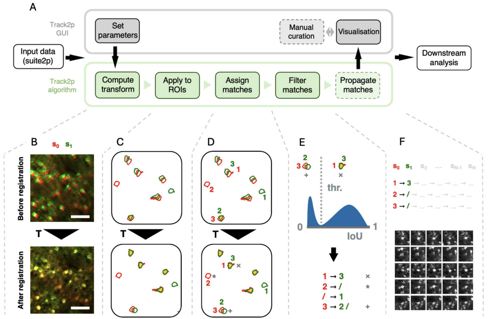

# Algorithm overview

Here is a brief description of how the algorithm implements tracking, for more information see the [preprint](https://www.biorxiv.org/content/10.1101/2025.02.26.640367v1).

Tracking neuronal activity across multiple days presents unique challenges due to the dynamic nature of brain development. We developed a novel tracking algorithm, called Track2p. As in other tracking algorithms for calcium imaging data the final goal of Track2p is to follow individual cells across sessions allowing the user to compare their functional properties in downstream analyses. To achieve this goal, the algorithm takes as input a set of preprocessed recordings , each consisting of a set of regions of interest (ROIs i.e. putative neurons detected based on activity, see Methods) and their respective calcium fluorescence traces, as well as a mean image of the field of view (FOV). Briefly, the algorithm aims to match ROIs in any given pair of consecutive sessions based on their spatial overlap, assuming that the more the two overlap in anatomical space, the more likely they correspond to the same neuron. Due to developmental processes such as brain growth and other experimental factors, it is necessary to account for day-to-day changes that occur between the two recordings before computing spatial overlaps. This is achieved by performing affine image registration on the mean FOV images between consecutive days.

We apply the registration and spatial matching iteratively, starting with the first pair of sessions (s0 and s1) as follows (Fig. A):

Firstly, we estimate the spatial transformation between s0 and s1 using affine image registration (Fig. B, the transformation is denoted as T). We employ affine transformation, since it can account both for rigid transformations (rotations and translations arising from minor mismatches in FOV alignment across experiments) as well as scaling and shearing (mostly due to brain growth). The changes across the two consecutive recordings are approximated as the transformation registering the mean FOV from session s1 (green in Fig. B) to the mean FOV of s0 serving as reference (red in Fig. B). 

Secondly, the computed transformation is applied to the ROIs from session s1 (green in Fig. C) to align them to ROIs from session s0 (red in Fig. C). The amount of spatial overlap after registration (yellow in Fig. C, bottom), can indicate the accuracy of the estimated transformation between the two days. Assuming that the transformation is accurately estimated, ROIs corresponding to the same cells display substantial spatial overlap, with some ROIs from one recording also potentially overlapping poorly, if not at all, with any ROI from another. 

Thirdly, once the ROIs are aligned, the algorithm proceeds with the matching (Fig. D). This is done by computing a spatial similarity metric (intersection over union - IoU) between each ROI from session s0 and each transformed ROI from session s1. Matches are then assigned in a globally optimal way by maximising the sum of IoU values across all matches using a linear sum assignment algorithm. 

Finally, since two consecutive sessions contain different sets of detected cells (see * in Fig. D, bottom) and since ROIs can overlap even if the signal does not come from the same cells (see + in Fig. D, bottom) we perform an additional filtering step on the assigned matches. Assuming that the IoU values for putative true and putative false matches come from different distributions, we would expect a bimodal distribution of IoU values across all assigned matches (see histogram in Fig. E). To reject the putative false positives, we compute a threshold based on automatic thresholding methods (Otsu’s method). This ensures that assigned matches with low spatial similarity are rejected (see + in Fig. D and E) while the matches with high similarity are accepted (see x in Fig. D and E). This yields the final matching for the first pair of consecutive imaging sessions (s0 and s1). In the case of more than 2 recordings, this tracking procedure is then iteratively applied for all consecutive pairs of sessions (s0 to s1, s1 to s2 … sN-1 to sN , and so on), with tracks being extended sequentially from s0 to sN based on the identified matches, and terminated if a match was not identified at any particular session.