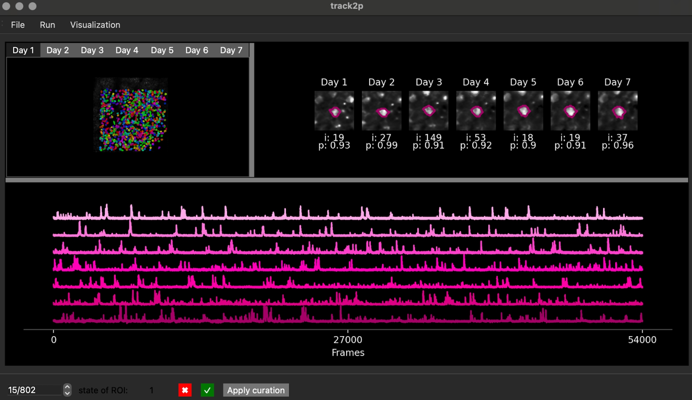

# GUI overview

## Toolbar

The user has three buttons on the toolbar:

- `Run` : launches the algorithm.
- `File` : imports data already processed by the algorithm.
- `Visualization` : allows results to be visualized using raster plots, providing a graphical representation of neuronal activity of the whole matched population over time (for more information see: ['Using the GUI' > 'Generating raster plots'](https://track2p.github.io/gui_raster.html))

## Central window

The central window is dedicated to visualising identified matches (individual cells over days). It shows all identified matches where the user can then select an individual match and visualise how the cell looks across all days as well as its activity on each day. For more information see: ['Using the GUI' > 'Visualising tracked cells'](https://track2p.github.io/gui_interactive_vis.html)

## Bottom bar

The bottom bar is used to manually curate the outputs of track2p. For more information see: ['Using the GUI' > 'Curation of track2p outputs'](https://track2p.github.io/gui_curation.html)

## More info

For a more detailed overview of the GUI see the paper (`Supplementary Information: Software > Interactive visualisation and curation using the Track2p GUI`).
