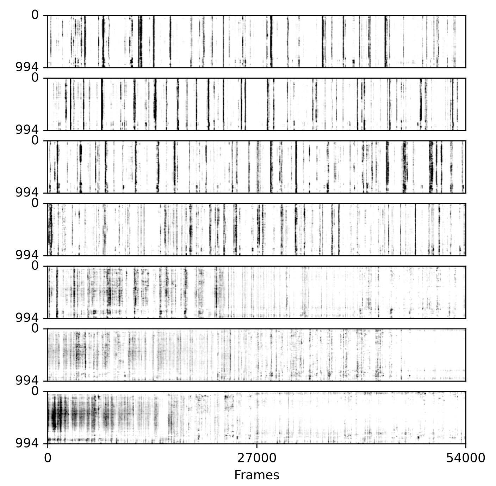

# Generating raster plots

To generate raster plots, the user should launch the GUI through `python -m track2p` and navigate to the 'Visualization' tab on the top of the window and select 'Generate raster plot' from the dropdown menu. This will open a pop-up window that will allow the user to set the path to track2p output folder and to set several parameters.

IMAGE

The user can use `PCA`(Principal Component Analysis) and `t-SNE` (t-distributed Stochastic Neighbor Embedding) techniques to re-sort the rasters based on dimensionality reduction. This allows for more intuitive visualisations that can reveal structure within the neuronal activity traces. Additionally, this sorting can be applied for a specific day and applied to all other days. This makes it possible to analyze variations in cell activity from day to day by perserving the sorting of the matched cells.

The user can also enter advanced settings:

- Averaging bin size : to smooth the plot raster data over a defined time interval. (Note: currently, the total number of frames of the recurding should be divisible with the entered number)
- vmin and vmax parameters allow to adjust the contrast

Below is an example of a raster plot generated using tsne for sorting, the sorting was computed on last day and each 10 time frames were averaged to smooth the data (recording of developing mouse barrel cortex for consecutive 7 days).

