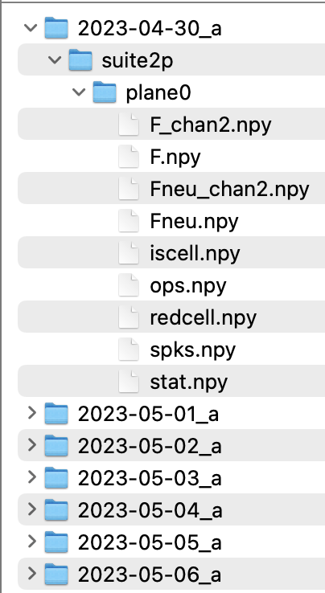
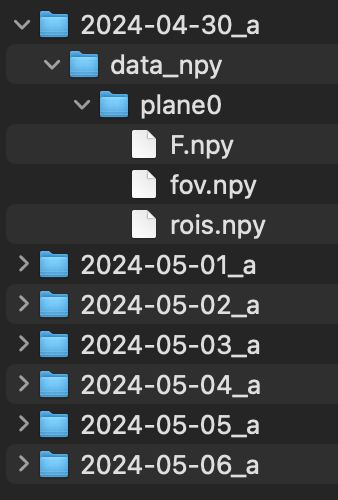

# Inputs and parameters

## Input data organization

_ _Warning: to avoid issues with loading data, avoid modifying the paths where the datasets are stored after running track2p. This is because the interface uses the paths to the suite2p datasets saved in `track_ops.npy` (`track_ops.all_ds_path`)_ _

There are two input formats accepted by Track2p - the proprietary Suite2p format as well as a more flexible format storing data in raw .npy arrays. The differences between the two are discussed below and the format is specified by the user by setting the `track_ops.input_format` setting to either `suite2p` or `npy`

### Suite2p format

In this case we assume each of the recordings that are to be matched contains processed data in the default 'suite2p format'. In that case each recording folder has a subfolder named 'suite2p', which in terms contains one sub-folder per plane. Each of these 'plane' subfolders contains the usual suite2p outputs for the neurons recorded within that plane (see: https://suite2p.readthedocs.io/en/latest/outputs.html). In the case of running suite2p individually for simultaneously recorded planes, the user can reconstruct this convention by putting the results of the second suite2p run to a manually added 'plane1' subfolder etc.

Below is an example of file organisation for a mouse imaged over 7 days (single plane). 

### Raw .npy arrays

In this case we assume that each recording folder has a subfolder named 'data_npy', which in terms contains one sub-folder per plane. Each of these 'plane' subfolders contains three numpy arrays:
- `F.npy`: float array of shape: (n_roi x n_timepoints) - containing fluorescence derived traces (e. g. raw F, dF/F, deconvolved F...)
- `fov.npy`: float array of shape: (npix_y x npix_x) - containing the image used for registration across days
- `rois.npy`: bool array of shape (n_roi x npix_y x npix_x) - containing binary masks for all detected ROIs (NOTE: ROIs should be aligned with the fov image for tracking to work successfully)

Below is an example of file organisation for a mouse imaged over 7 days (single plane). 

## Parameters

Access to all parameters is currently only available when running track2p programmatically, but we allow users to change the crucial parameters in the GUI. In either case the default parameters should work well in most cases. The parameters available through the gui are marked with an asterisk (*).

- `track_ops.all_ds_path`* : list of paths to datasets containing a `suite2p` or `data_npy` folder 
- `track_ops.input_format`* : either `suite2p` or `npy` depending on the format of the input data
- `track_ops.save_path`* : where the outputs will be saved (a `track2p` folder will be generated here)
- `track_ops.reg_chan`* : channel to use for registration (0=functional, 1=anatomical) 
- `track_ops.transform_type`* : either `affine` or `rigid` depending on the transform used (`rigid` might be ok for adult data) 
- `track_ops.iscell_thr`* : either `None` if using manual curation from suite2p or a value between `0` and `1` to choose based on calssifier probability
- `track_ops.thr_method`* : automatic thresholding method for filtering matches, can be either `otsu` (Otsu's method) or `min` (Local minimum of estimated probability density function)
- `track_ops.save_in_s2p_format`* : save the outputs in suite2p format where the rows are matched (for example F[0,:] from one day corresponds to the same cell as F[0,:] on another day)
- `track_ops.matching_method` : determines what is used to calculate pairwise cost of each possible pair of ROIs across two different recordings. Can be set to `iou` (intersection over union) or `cent` (euclidean distance of centroids) - `iou` probably works much better in most cases, especially with dense labelling.   
- `track_ops.iou_dist_thr` : distance between centroids (in pixels) above which to skip iou computation (to save time) (this is only relevant if `self.matching_method=='iou'`)
- `track_ops.win_size` : window size for visualising matched ROIs across days (crop of mean image). This will only affect visualisation.
- `track_ops.sat_perc` : percentile to saturate FOV image at. This will only affect visualisation.

## Supplementary `track.ops` parameters (GUI)

-  `track_ops.colors`: It's a color vector assigning a specific color to each cell. When the user opens a track2p dataset, each cell retains the same color at each opening.
A vector is created per plane `colors_plane_x`
- `track_ops.vector_curation` : It is a vector of the length of the number of cells found every day by our algorithm. It represents the state of each cell, varying between 0 and 1, where 0 means that it is considered "not cell" by the user, and 1 means that it is recognized as a "cell". It is appallingly updated by the user’s choice. 
A vector is created per plane `vector_curation_plane_x`
