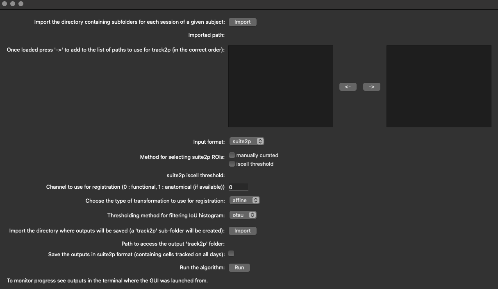

# Run track2p through the GUI

After activating the GUI through `python -m track2p` the user should navigate to the 'Run' tab on the top left of the window and select 'Run track2p algorithm' from the dropdown menu.

This will open a pop-up window that will allow the user to set the paths to consecutively recorded datasets and to set the algorithm parameters (see screenshot below). After configuring these settings, the user can click 'Run' to run the track2p algorithm, and the progress will be displayed in the terminal.

Once the algorithm finishes a subsequent pop-up window will prompt the user to decide whether they wish to visualize the results within the interface.

## GUI inputs and parameters

This section explains the parameters available in the GUI in a bit more detail. For more information see [Run track2p > Inputs and parameters](https://track2p.github.io/run_inputs_and_parameters.html).

### Data paths

This is where the user selects the suite2p directories that are to be processed by the algorithm. We recommend that all the recordings that are to be matched reside wihtin the same parent directory, however this is not strictly necessary. For example above `2023-04-05_a`, `2023-04-06_a` ... all reside in a folder specific for that mouse. When clicking on 'import' the user can then navigate to that parent directory and select subfolders (datasets such as `2023-04-05_a`) individually to move them to the right hand column using the arrows underneath the list.

 **Note:** when selecting suite2p datasets the order in which they are passed to the right side column matters, since the recordings will be matched in this order. We recommend the most straightforward way of selecting the datasets in chronological (or reverse chronological) order. 

### Selecting ROIs (suite2p specific)

You can choose between `manually curated` and `iscell threshold`. Choosing 'manually curated' means that manual adjustments made by the user in the Suite2p interface will be taken into account. As a reminder, Suite2p detects regions of interest (ROIs) in an automated manner. After this detection, users can annotate each ROI by manually classifying them as “cell” or “not cell”. By selecting the 'manually curated' option, the algorithm will only test ROIs classified as “cell” for matching with other days of recordings. On the other hand, when selecting 'iscell_thr', the manual curation is ignored (if it exists) and instead the suite2p's classifier values are considered (see: https://suite2p.readthedocs.io/en/latest/gui.html#classifying-cells). Only ROIs to which the Suite2p classifier assigns a value above this threshold will be considered for tracking by the algorithm.

**Note1:** Despite the manual curation on individual recordings it is still important for the user to manually inspect the matches, since curation on individual datasets does not necessarily imply a good quality of tracking across days.

**Note2:** This option is only available when using the `suite2p` format, when using `numpy` we assume the selection is done beforehand, namely that the ROIs included in the data are already the ones considered as cells.

### Channel to use for registration (suite2p specific)

This will choose which channel from the suite2p output data will be used for registration (for more info see the paper). This option is only available if the original recording is a 2-channel (for suite2p: `ops.nchannels=2`) one and it is preprocessed so that the second channel is also included in the Suite2p outputs (for suite2p: `ops["meanImg_chan2"]` exists). 

**Note:** This option is only available when using the `suite2p` format, when using `numpy` we assume that the image saved in the folder by the user is the one that is optimal to do the alignment. Importantly in this case this image should also be aligned with the ROIs (this is done automatically in the case of suite2p outputs)

### Transformation to use for registration

This will choose which type of transform to use. The user can choose either `rigid` which can account for translations and rotations, `affine` additionally allows for scaling and shearing. Affine should be used especially when applying to data in development, but might even work better in general.

### Thresholding method for IoU histogram

The method to determine which threshold to use when filtering out putative false positive matches across a pair of days. `otsu` uses the Otsu method and `min` sets the threshold based on the local minimum of an estimated probability density function. Both work on the distribution of IoU's for initial paired matches across two recordings. From our experience `otsu` is slightly more conservative compared to `min`, but that might depend on the particular dataset / preparation.

### Save outputs in suite2p format

Another option that we offer to the user is to tick the option `Save the outputs in suite2p format (containing cells tracked on all days)`. In this case, the gui will save a version of the Suite2p datasets (stat.npy, iscell.npy, F.npy..) containing only the cells tracked on all days. Additionally, the data saved in the 'matched suite2p' format is re-ordered in a way that the cell index 0 on the first day will correspond to cell index 0 on the second day etc. The user can then use this data as they would normally with the suite2p gui, for example by dragging and dropping `stat.npy` files for different days. The cells in this case will have the same color on different days, and examine for example ROI 0 for each day, the user can see that it corresponds to the same cell for all different days. The data saved in the 'matched suite2p' format will be located in a  `matched_suite2p` folder inside the track2p folder, and will be organised in the same way as the original data (in default suite2p format, for more information see above).
